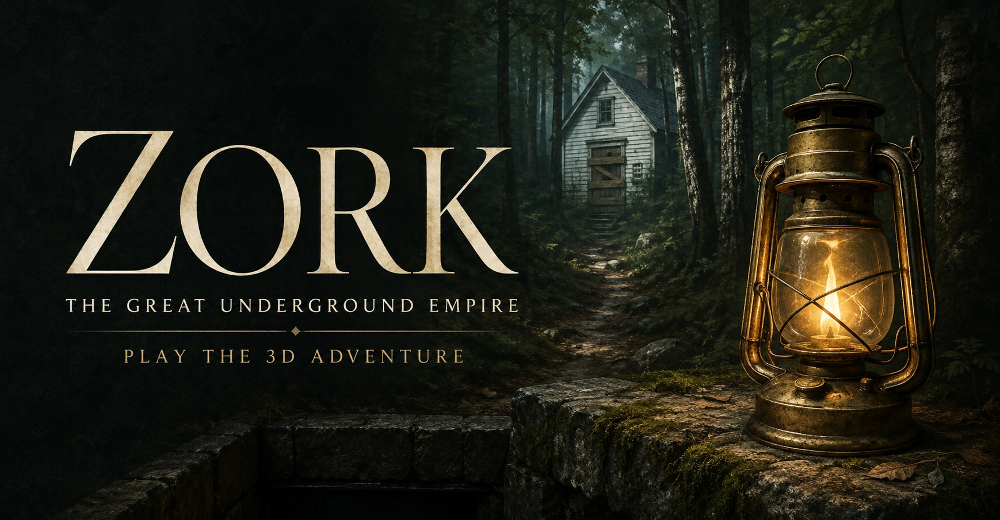

# Zork — The Great Underground Empire



A first-person 3D adaptation of **Zork I**. Explore the white house and the world beneath it, solve its puzzles, face the troll and thief, and recover nineteen treasures. Original Zork descriptions accompany the adventure.

**[Play in your browser](https://zork-underground-empire.netlify.app/)** on a computer, phone, or tablet with WebGL 2 support.

## Run from source

Install **Node.js 24** with npm, then:

```sh
git clone https://github.com/emollick/zork-underground-empire.git
cd zork-underground-empire
npm ci
npm run dev
```

Open the address printed in the terminal, normally `http://127.0.0.1:5193/`. In Windows PowerShell, use `npm.cmd` in place of `npm` if script execution is restricted. No account, API key, or external asset service is required to run the game.

```sh
npm test        # Campaign, puzzle, save, route, combat and touch-input checks
npm run check   # TypeScript checks
npm run build   # Check types and build dist/
npm start       # Serve dist/ at http://127.0.0.1:5195/
```

`dist/` is a static site. Textures, fonts, and notices are included in the build; the game does not need a backend. Development and local serving bind to the local computer.

For offline play, the **[Windows download](https://github.com/emollick/zork-underground-empire/releases/latest)** includes its own runtime: extract the complete folder and open **Play Zork.cmd**. The source repository and GitHub's source ZIP require the Node/npm setup above; they do not include that runtime.

## Controls

| Action | Keyboard and mouse |
| --- | --- |
| Move / look | WASD / mouse; arrow keys also turn |
| Run / jump | Shift / Space |
| Examine, collect, use, travel | E |
| Strike | Left mouse button or F |
| Guard / timed parry | Hold right mouse button or R |
| Dodge | Q with a movement direction; Q alone steps back |
| Lantern | L |
| Journal / map / satchel | J / M / Tab |
| Pause | Esc |

Mouse look works without holding a button. Press **Esc** to release the pointer, then **Return to the adventure** to resume. If pointer capture is unavailable, move the mouse normally; keeping it near an edge continues turning.

On a phone or tablet, touch controls appear automatically. Drag the left stick to move, push farther to run, and swipe the world on the right to look. You can move and look together. Tap the prompt to interact; use **Strike**, **Dodge**, **Jump**, **Lamp**, and hold **Guard**. Equipment buttons appear when you have the items. Journal, map, satchel, and pause are available through the on-screen menus. Tap a spoken-answer field to open your keyboard. Portrait and landscape layouts are supported.

## Playing and saving

The journal records discoveries and offers three optional hint levels, from a nudge to an explicit solution. Rest at a hearth or safe camp to recover and unlock return travel. Choose **Explorer**, **Adventurer**, or **Veteran** in Settings; graphics, sensitivity, sound, and camera motion are adjustable too.

At puzzles that call for an item, examine the obstacle and choose something from your satchel. Unsuitable choices leave your possessions intact; **Step away** lets you return later. Spoken-answer puzzles accept typed responses.

Progress saves in your browser. Use **Continue expedition** to return, or **Export saved expedition** and **Import saved expedition** in the pause menu to move a save between browsers or devices. The online, development, and local editions have separate saves. Export a copy before clearing browser data or replacing an expedition.

This independent adaptation condenses Zork I into thirty areas, including one maze chamber, and follows its nineteen-treasure and Stone Barrow ending. It uses contextual interactions and real-time combat in place of the original parser. Zork II and III are outside its scope.

## License and credits

The adaptation code, documentation, and original project assets use the [MIT License](LICENSE). Zork's original source and prose retain [Microsoft's MIT notice](licenses/ZORK-MIT.txt); third-party textures, fonts, libraries, and runtime components retain their own licenses. See [CREDITS.md](CREDITS.md) for attribution and scope.

The cover is an AI-generated illustration. This is an independent adaptation, with no official endorsement from Microsoft, Activision, or Infocom.
